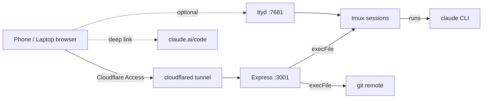

<!--
doc: README
last-refreshed: 2026-05-29
generated-by: doc-refresh skill
-->

# ccfleet

**A web dashboard for centrally managing Claude Code remote-control sessions. Start and stop Claude Code processes from a browser, then connect to them from the Claude Code desktop, mobile, or web app.**

> **SECURITY:** ccfleet has no built-in authentication. Access control is provided by Cloudflare Access (JumpCloud SAML) when accessed remotely, and by network trust on the local LAN. Never expose port `3001` directly to the public internet. See [`SECURITY.md`](SECURITY.md).

## Quick Start

> **Prerequisites:** Node.js 20+, `tmux`, `claude` CLI, and a populated `~/git/` directory of repositories.

```bash
# 1. Clone and install
git clone <repo-url>
cd ccfleet
npm install

# 2. Configure environment
cp .env.example .env
# Edit .env — fill in GIT_ROOT at minimum

# 3. Verify with tests
npm test

# 4. Run
npm start
```

Open `http://<host>:3001`.

## What This Does

ccfleet lets you manage Claude Code sessions from any browser. It scans a directory of git repositories, shows which ones have an active `claude` process, and lets you start or stop a session with one tap. Once a session is running, open it directly in the Claude Code desktop, mobile, or web app using the Remote Control feature — the actual conversation happens there. ccfleet only handles the lifecycle of the underlying tmux sessions; it does not wrap Claude Code, proxy its traffic, or store any credentials.

## Architecture in 30 Seconds



## Key Files

| Path | Purpose |
|------|---------|
| `server.js` | Express app, all HTTP routes |
| `lib/projects.js` | Scans `GIT_ROOT` for git repositories |
| `lib/tmux.js` | Wraps `tmux list-sessions`, `new-session`, `kill-session` |
| `lib/git.js` | Extracts the project name from `git remote get-url origin` |
| `lib/claude.js` | Builds the `claude` launch command and checks for prior session history |
| `lib/health.js` | Synthetic probes for `tmux`, `claude`, and `GIT_ROOT` |
| `lib/sanitize.js` | Strict input validators (project names, session names) |
| `public/` | Static frontend (vanilla JS, no build step) |
| `launchd/` | macOS LaunchDaemon plists for boot-time startup |
| `scripts/install-launchd.sh` | Install/uninstall launchd services (macOS) |
| `scripts/install-systemd.sh` | Install/uninstall systemd services (Linux) |
| `docs/spec.md` | Full specification |
| `docs/assumptions.md` | Recorded non-obvious decisions |

## Commands

| Command | What it does |
|---------|--------------|
| `npm install` | Install dependencies |
| `npm test` | Run the unit test suite |
| `npm start` | Start the Express server |
| `sudo bash scripts/install-launchd.sh` | Install as boot-time launchd services (macOS) |
| `sudo bash scripts/install-systemd.sh` | Install as boot-time systemd services (Linux) |

## Environment Variables

See [`docs/ENV_VARS.md`](docs/ENV_VARS.md) for the full reference.

| Variable | Required | Description |
|----------|----------|-------------|
| `PORT` | no | HTTP port (default `3001`) |
| `GIT_ROOT` | yes | Directory containing project subdirectories |
| `CLAUDE_MODEL` | no | Model passed to `--model` (default `claude-sonnet-4-6`) |
| `CLAUDE_EFFORT` | no | Effort level: `low`, `medium`, `high`, or `highest` (default `medium`) |
| `CLAUDE_SKIP_PERMISSIONS` | no | Set to `true` to pass `--dangerously-skip-permissions` — **disables all file permission checks**. Default `false`. See warning below. |
| `REMOTE_CONTROL_PREFIX` | no | Prefix for `--remote-control` identifiers (default `MacMini`) |
| `TTYD_URL` | no | URL of optional `ttyd` terminal |
| `REMOTE_CONTROL_URL` | no | Override for the Open button (default `https://claude.ai/code`) |
| `LOG_LEVEL` | no | `pino` log level (default `info`) |

## ⚠ Warning: CLAUDE_SKIP_PERMISSIONS

> **Do not set `CLAUDE_SKIP_PERMISSIONS=true` unless you fully understand what it does and accept all responsibility for the consequences.**

When enabled, every claude session launched by ccfleet receives the `--dangerously-skip-permissions` flag. This disables all permission prompts — claude can read, write, execute, and delete any file your user account can access, on any project, without asking first. There is no undo for deleted or overwritten files.

This flag exists for specific automated or headless workflows where interactive prompts are not possible. For normal use, leave it unset. The name "dangerously" is not a formality.

## Troubleshooting

| Symptom | Likely cause | Fix |
|---------|--------------|-----|
| Server exits with `GIT_ROOT must be set` | `GIT_ROOT` env var missing | Set `GIT_ROOT` to the absolute path of your git directory |
| `/api/projects` returns empty list | `GIT_ROOT` has no direct child directories with a `.git/` entry | Confirm with `ls -la $GIT_ROOT/*/.git` |
| New session fails immediately on start | `--continue` against a project with no prior history | ccfleet detects this automatically — file a bug if it happens |
| New session "starts" but is invisible in Remote Control | Claude blocked on workspace-trust dialog | ccfleet pre-trusts new projects; if it still happens, `tmux attach -t <name>` to approve, then file a bug |
| `/readyz` returns 503 | `tmux` not on `PATH` | `brew install tmux` |
| Attach button is disabled | `TTYD_URL` not set | Start `ttyd` and set `TTYD_URL` in `.env` |

## Contributing

See [`CONTRIBUTING.md`](CONTRIBUTING.md).
