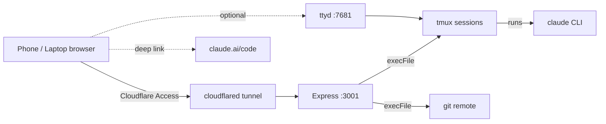

<!--
doc: README
last-refreshed: 2026-06-01
generated-by: doc-refresh skill
-->

# ccfleet

**A web dashboard for centrally managing Claude Code remote-control sessions. Start and stop Claude Code processes from a browser, then connect to them from the Claude Code desktop, mobile, or web app.**

> **SECURITY:** ccfleet has no built-in authentication. Access control is provided by Cloudflare Access (JumpCloud SAML) when accessed remotely, and by network trust on the local LAN. Never expose port `3001` directly to the public internet. See [`SECURITY.md`](SECURITY.md).

## Quick Start

> **Prerequisites:** Node.js 20+, `tmux`, `claude` CLI, and a populated `~/git/` directory of repositories.

**Option A — Docker (Linux only)**

> Docker requires a Linux host. On macOS the container runs inside a VM that
> cannot reach the host tmux server or the host `claude` binary, so sessions
> will not work. Use Option B or C on macOS.

```bash
git clone <repo-url>
cd ccfleet
cp .env.example .env   # fill in GIT_ROOT at minimum
docker compose up -d
```

**Option B — Node directly (foreground)**

```bash
git clone <repo-url>
cd ccfleet
npm ci --omit=dev
cp .env.example .env   # fill in GIT_ROOT at minimum
npm test               # 99/99 should pass
npm start
```

Open `http://<host>:3001`.

**Option C — Boot-time service (macOS or Linux)**

This is the recommended path for a machine you SSH into. The service starts before any user logs in and restarts automatically if it crashes.

*macOS (launchd):*
```bash
git clone <repo-url>
cd ccfleet
cp .env.example .env   # fill in GIT_ROOT at minimum
sudo bash scripts/install-launchd.sh
```

The script installs both ccfleet and ttyd as LaunchDaemons under
`/Library/LaunchDaemons/`. Dependencies (`node_modules`) are installed
automatically if missing. Logs land in `~/Library/Logs/ccfleet/`.

```bash
# Verify it started
curl http://localhost:3001/readyz          # {"status":"ok"}
launchctl list | grep ccfleet             # both services listed

# Uninstall
sudo bash scripts/install-launchd.sh uninstall
```

*Linux (systemd):*
```bash
git clone <repo-url>
cd ccfleet
npm ci --omit=dev
cp .env.example .env   # fill in GIT_ROOT at minimum
sudo bash scripts/install-systemd.sh
```

Open `http://<host>:3001`.

## What This Does

ccfleet lets you manage Claude Code sessions from any browser. It scans a directory of git repositories, shows which ones have an active `claude` process, and lets you start or stop a session with one tap. Once a session is running, open it directly in the Claude Code desktop, mobile, or web app using the Remote Control feature — the actual conversation happens there. ccfleet only handles the lifecycle of the underlying tmux sessions; it does not wrap Claude Code, proxy its traffic, or store any credentials.

## Architecture in 30 Seconds


```mermaid
graph LR
  Phone[Phone / Laptop browser] -- Cloudflare Access --> Tunnel[cloudflared tunnel]
  Tunnel --> Express[Express :3001]
  Express -- execFile --> Tmux[tmux sessions]
  Express -- execFile --> Git[git remote]
  Tmux -- runs --> Claude[claude CLI]
  Phone -. deep link .-> RemoteControl[claude.ai/code]
  Phone -. optional .-> Ttyd[ttyd :7681]
  Ttyd --> Tmux
```

## Key Files

| Path | Purpose |
|------|---------|
| `server.js` | Express app, all HTTP routes |
| `lib/projects.js` | Scans `GIT_ROOT` for git repositories |
| `lib/tmux.js` | Wraps `tmux list-sessions`, `new-session`, `kill-session`, `respawn-pane` |
| `lib/git.js` | Extracts the project name from `git remote get-url origin` |
| `lib/claude.js` | Builds the `claude` launch command and checks for prior session history |
| `lib/health.js` | Synthetic probes for `tmux`, `claude`, and `GIT_ROOT` |
| `lib/sanitize.js` | Strict input validators (project names, session names) |
| `public/` | Static frontend (vanilla JS, no build step) |
| `launchd/` | macOS LaunchDaemon plists for boot-time startup |
| `scripts/install-launchd.sh` | Install/uninstall launchd services (macOS) |
| `scripts/install-systemd.sh` | Install/uninstall systemd services (Linux) |
| `docs/spec.md` | Full specification |
| `docs/assumptions.md` | Recorded non-obvious decisions |

## Commands

| Command | What it does |
|---------|--------------|
| `npm ci --omit=dev` | Install production dependencies (use `npm ci` for dev/test) |
| `npm test` | Run the unit test suite (99 tests) |
| `npm run lint` | Run ESLint across all source files |
| `npm start` | Start the Express server |
| `docker compose up -d` | Run in Docker — **Linux hosts only** (see `Dockerfile`, `docker-compose.yml`) |
| `sudo bash scripts/install-launchd.sh` | Install as boot-time launchd services (macOS) |
| `sudo bash scripts/install-systemd.sh` | Install as boot-time systemd services (Linux) |

## Git Hooks

After cloning, run the one-time hook installer:

```bash
scripts/install-hooks.sh
```

This points git at the version-controlled hooks in `.githooks/` via `core.hooksPath`. The hooks are optional — ccfleet runs fine without them — but they catch real problems before they reach CI or production.

| Hook | When it runs | What it checks |
|------|-------------|---------------|
| `pre-commit` | Every `git commit` | Staged secrets and `.env` files; merge conflict markers; files over 1 MB; `console.log` in production code; `// TODO` comments; `.only()` in test files (which would skip the rest of the suite in CI); `package.json`/lockfile out of sync; shellcheck on shell scripts; ESLint on staged JS; full test suite |
| `pre-push` | Every `git push` | Blocks direct pushes to `main`; full lint and test suite |

**Why bother if CI already catches this?** The hooks give you the feedback in ~3 seconds at commit time instead of 2–3 minutes after a push. Secrets in particular are the one failure mode worth catching before they leave your machine — rotating a committed credential that hit a remote is painful even if you catch it immediately.

**Bypassing:** `git commit --no-verify` skips the pre-commit hook for a single commit. CI on the pull request remains the enforcement boundary and cannot be bypassed.

**Uninstalling:** `git config --unset core.hooksPath`

## Environment Variables

See [`docs/ENV_VARS.md`](docs/ENV_VARS.md) for the full reference.

| Variable | Required | Description |
|----------|----------|-------------|
| `PORT` | no | HTTP port (default `3001`) |
| `GIT_ROOT` | yes | Directory containing project subdirectories |
| `CLAUDE_MODEL` | no | Model passed to `--model` (default `claude-sonnet-4-6`) |
| `CLAUDE_EFFORT` | no | Effort level: `low`, `medium`, `high`, or `highest` (default `medium`) |
| `CLAUDE_SKIP_PERMISSIONS` | no | Set to `true` to pass `--dangerously-skip-permissions` — **disables all file permission checks**. Default `false`. See warning below. |
| `REMOTE_CONTROL_PREFIX` | no | Prefix for `--remote-control` identifiers (default: machine hostname via `os.hostname()`) |
| `TTYD_URL` | no | URL of optional `ttyd` terminal |
| `REMOTE_CONTROL_URL` | no | Override for the Open button (default `https://claude.ai/code`) |
| `LOG_LEVEL` | no | `pino` log level (default `info`) |

## Claude login

Sessions need a claude.ai subscription login. It is the only login type that supports Remote Control and your claude.ai MCP connectors. Log in once as the user ccfleet runs as:

```bash
claude            # then /login, and choose your Claude subscription
curl -s http://localhost:3001/health   # claude_auth should be {"status":"ok","method":"claude.ai"}
```

On an SSH-only machine the CLI stores this login in `~/.claude/.credentials.json` (mode `600`). The boot-time service can read that file before anyone logs in at the desktop, so sessions authenticate at boot. If your login ended up in the macOS Keychain instead (`security find-generic-password -s "Claude Code-credentials"` finds it), the service may not be able to read it after a reboot. `/health` will show `claude_auth: fail` if so.

**Do not set `CLAUDE_CODE_OAUTH_TOKEN` or `ANTHROPIC_API_KEY` in ccfleet's `.env`.** A token from `claude setup-token` or an API key overrides the subscription login and only covers model calls. Sessions still start, but Remote Control never comes up and the claude.ai MCP connectors disappear. `/health` reports this as `claude_auth: degraded` with the method it found.

`/health` checks that a login is present and readable. It can't tell whether a login has expired; if sessions stop authenticating, repeat the `/login` step above.

## ⚠ Warning: CLAUDE_SKIP_PERMISSIONS

> **Do not set `CLAUDE_SKIP_PERMISSIONS=true` unless you fully understand what it does and accept all responsibility for the consequences.**

When enabled, every claude session launched by ccfleet receives the `--dangerously-skip-permissions` flag. This disables all permission prompts — claude can read, write, execute, and delete any file your user account can access, on any project, without asking first. There is no undo for deleted or overwritten files.

This flag exists for specific automated or headless workflows where interactive prompts are not possible. For normal use, leave it unset. The name "dangerously" is not a formality.

## Troubleshooting

| Symptom | Likely cause | Fix |
|---------|--------------|-----|
| Server exits with `GIT_ROOT must be set` | `GIT_ROOT` env var missing | Set `GIT_ROOT` to the absolute path of your git directory |
| `/api/projects` returns empty list | `GIT_ROOT` has no direct child directories with a `.git/` entry | Confirm with `ls -la $GIT_ROOT/*/.git` |
| New session fails immediately on start | `--continue` against a project with no prior history | ccfleet detects this automatically — file a bug if it happens |
| New session "starts" but is invisible in Remote Control | Claude blocked on workspace-trust dialog | ccfleet pre-trusts new projects; if it still happens, `tmux attach -t <name>` to approve, then file a bug |
| `/readyz` returns 503 | `tmux` not on `PATH` | `brew install tmux` |
| Attach button is disabled | `TTYD_URL` not set | Start `ttyd` and set `TTYD_URL` in `.env` |

## Contributing

See [`CONTRIBUTING.md`](CONTRIBUTING.md).
